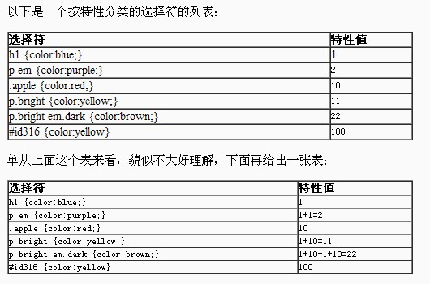

所谓CSS优先级，即是指CSS样式在浏览器中被解析的先后顺序。

样式表中的特殊性描述了不同规则的相对权重，它的基本规则是：

统计选择符中的ID属性个数。
统计选择符中的CLASS属性个数。
统计选择符中的HTML标记名个数。

最后，按正确的顺序写出三个数字，不要加空格或逗号，得到一个三位数(css2.1是用4位数表示)。(注意，你需要把数字转换成一个以三个数字结尾的更大的数)。相应于选择符的最终数字列表可以很容易确定较高数字特性凌驾于较低数字的。

每个ID选择符(#someid)，加 0,1,0,0。
每个class选择符(.someclass)、每个属性选择符(形如[attr=value]等)、每个伪类(形如:hover等)加0,0,1,0。
每个元素或伪元素(:firstchild)等，加0,0,0,1。
其它选择符包括全局选择符*，加0,0,0,0。相当于没加，不过这也是一种specificity，后面会解释。

通过上面，就可以很简单的看出，HTML标记的权重是1,CLASS的权重是10,ID的权重是100，继承的权重为0

按这些规则将数字符串逐位相加，就得到最终的权重，然后在比较取舍时按照从左到右的顺序逐位比较。

优先级问题其实就是一个冲突解决的问题，当同一个元素（内容）被CSS选择符选中时，就要按照优先级取舍不同的CSS规则，这其中涉及到的问题其实很多。

###CSS的继承性和继承的局限性###

继承是CSS的一个主要特征，它是依赖于祖先-后代的关系的。继承是一种机制，它允许样式不仅可以应用于某个特定的元素，还可以应用于它的后代。

有一些属性不能被继承，如：border, margin, padding, background等。

###附加说明###

文内的样式优先级为1,0,0,0，所以始终高于外部定义。这里文内样式指形如&lt;div style="color:red"&gt;blah&lt;/div&gt;的样式，而外部定义指经由&lt;link&gt;或&lt;style&gt;卷标定义的规则。
有!important声明的规则高于一切。
如果!important声明冲突，则比较优先权。
如果优先权一样，则按照在源码中出现的顺序决定，后来者居上。
由继承而得到的样式没有specificity的计算，它低于一切其它规则(比如全局选择符*定义的规则)。
关于经由@import加载的外部样式，由于@import必须出现在所有其它规则定义之前(如不是，则浏览器应该忽略之)，所以按照后来居上原则，一般优先权冲突时是占下风的。

还需要说一下，IE是可以识别位置错误的@import的，但无论@import在什么地方，它都认为是位于所有其它规则定义之前的，这可能会引发一些误会。

优先权问题看起来简单，但背后还是有非常复杂的机制，在实际应用中需要多多留意。

