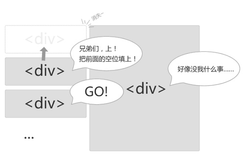
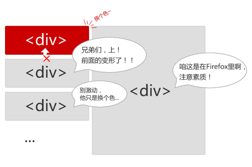

Web页面运行在各种各样的浏览器当中，浏览器载入、渲染页面的速度直接影响着用户体验。

简单地说，页面渲染就是浏览器将html代码根据CSS定义的规则显示在浏览器窗口中的这个过程。先来大致了解一下浏览器都是怎么干活的：

   1. 用户输入网址（假设是个html页面，并且是第一次访问），浏览器向服务器发出请求，服务器返回html文件；

   2. 浏览器开始载入html代码，发现&lt;head&gt;标签内有一个&lt;link&gt;标签引用外部CSS文件；

   3. 浏览器又发出CSS文件的请求，服务器返回这个CSS文件；

   4. 浏览器继续载入html中&lt;body&gt;部分的代码，并且CSS文件已经拿到手了，可以开始渲染页面了；

   5. 浏览器在代码中发现一个&lt;img&gt;标签引用了一张图片，向服务器发出请求。此时浏览器不会等到图片下载完，而是继续渲染后面的代码；

   6. 服务器返回图片文件，由于图片占用了一定面积，影响了后面段落的排布，因此浏览器需要回过头来重新渲染这部分代码；

   7. 浏览器发现了一个包含一行Javascript代码的&lt;script&gt;标签，赶快运行它；

   8. Javascript脚本执行了这条语句，它命令浏览器隐藏掉代码中的某个&lt;div&gt; (style.display="none")。杯具啊，突然就少了这么一个元素

   9. 终于等到了&lt;/html&gt;的到来，浏览器泪流满面……

   10. 等等，还没完，用户点了一下界面中的“换肤”按钮，Javascript让浏览器换了一下&lt;link&gt;标签的CSS路径；

   11. 浏览器召集了在座的各位&lt;div&gt;&lt;span&gt;&lt;ul&gt;&lt;li&gt;们，“大伙儿收拾收拾行李，咱得重新来过……”，浏览器向服务器请求了新的CSS文件，重新渲染页面。
   说到页面为什么会慢？那是因为浏览器要花时间、花精力去渲染，尤其是当它发现某个部分发生了点变化影响了布局，需要倒回去重新渲染，内行称这个回退的过程叫reflow。

 

reflow几乎是无法避免的。现在界面上流行的一些效果，比如树状目录的折叠、展开（实质上是元素的显示与隐藏）等，都将引起浏览器的 reflow。鼠标滑过、点击……只要这些行为引起了页面上某些元素的占位面积、定位方式、边距等属性的变化，都会引起它内部、周围甚至整个页面的重新渲染。通常我们都无法预估浏览器到底会reflow哪一部分的代码，它们都彼此相互影响着。

 
 
reflow问题是可以优化的，我们可以尽量减少不必要的reflow。比如开头的例子中的图片载入问题，这其实就是一个可以避免的reflow——给图片设置宽度和高度就可以了。这样浏览器就知道了图片的占位面积，在载入图片前就预留好了位置。

 另外，有个和reflow看上去差不多的术语：repaint，中文叫重绘。如果只是改变某个元素的背景色、文字颜色、边框颜色等等不影响它周围或内部布局的属性，将只会引起浏览器repaint。repaint的速度明显快于reflow（在IE下需要换一下说法，reflow要比repaint 更缓慢）。下次将通过一系列的实验说明在Firefox、IE等浏览器下reflow的优化。
