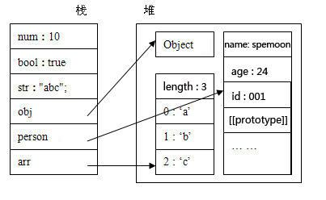

昨天在群里看到一个前端的兄弟发了一个问题，如下：

``` javacript
(function() {
    var A = function() {}
    A.prototype = {
        //在仅改变这里的代码的情况下，能否使console.log(a2.b.c);结果为1
        b : {
            c : 1
        }
    }
    var a1 = new A();
    var a2 = new A();
    a1.b.c = 2;
    console.log(a2.b.c);
})();
```

对于这个问题，我还真没法在仅修改 b : { c : 1 } 的情况下使结果为1。

在未改动代码的情况下，console.log(a2.b.c);的结果是2。

如果不明白，那我们来看看javascript的内存分配吧：

### 原始值和引用值

在ECMAScript中，变量可以存放原始值和引用值。

原始值，如Number, String, Boolean, Null, Undefined。 指的是代表原始数据类型，即基本数据类型，的值。

引用值，如Object, Function, Array, 以及自定义对象等。指的是复合数据类型的值。

### 栈和堆

简单的说，原始值放在内存中叫栈的地方，而引用值则放在堆中。

原始值是存储在栈中的简单数据段，也就是说，他们的值直接存储在变量访问的位置。

堆是存放数据的基于 散列算法 的 数据结构，也就是说，存储在变量处的值(即指向对象的变量，存储在栈中)是一个指针，指向存储在堆中的实际对象。

例：var obj = new Object(); obj 存储在栈中，它指向于 new Object()这个对象，而new Object()是存放在堆中的。

下面我们来看一个具体的例子：

``` javacript
function Person(id,name,age){
    this.id = id;
    this.name = name;
    this.age = age;
}
var num = 10;
var bool = true;
var str = "abc";
var arr = ['a','b','c'];
var obj = new Object();
var person = new Person(001,"spemoon",24);
```

然后我们来看一下内存分析图：



变量num,bol,str为基本数据类型，它们的值，直接存放在栈中，obj,person,arr为复合数据类型，他们的引用变量存储在栈中，指向于存储在堆中的实际对象。

由上图可知，我们无法直接操纵堆中的数据，也就是说我们无法直接操纵对象，但我们可以通过栈中对对象的引用来操作对象。

那为什么引用值要放在堆中，而原始值要放在栈中呢？

堆比栈大，栈比堆的运算速度快，对象是一个复杂的结构，并且可以自由扩展，如：数组可以无限扩充，对象可以自由添加属性。将他们放在堆中是为了不影响栈的效率。而是通过引用的方式查找到堆中的实际对象再进行操作。相对于简单数据类型而言，简单数据类型就比较稳定，并且它只占据很小的内存。不将简单数据类型放在堆是因为通过引用到堆中查找实际对象是要花费时间的，而这个综合成本远大于直接从栈中取得实际值的成本。所以简单数据类型的值直接存放在栈中。 

现在再让我们回过头来看开始的那个题目：

a1.b.c 这里是指向一个对象，即是堆中的一个引用值，故对其赋值，则会修改堆中的对象的引用，结果会使a2.b.c == 2。

如果上述代码这么写：

``` javacript
(function() {
    var A = function() {}
    A.prototype = {
        b : 1
    }
    var a1 = new A();
    var a2 = new A();
    a1.b = 2;
    console.log(a2.b);
})();
```

那么a2.b的结果是1，因为对于栈中的原始值，在进行赋值的过程中，其实是为a1新建了一个a1.b，并没有影响到A的原型上的b的值。

再看一个例子：

``` javacript
function a(){};   
a.prototype.xx=['a','b','c'];  
var a1 = new a();   
var a2 = new a();   
var a3 = new a();
a1.xx = ['a'];  
a3.xx.push(12); 
```

那现在a1.xx,a2.xx和a3.xx分别是多少？

结果是：a1.xx = ['a'],a2.xx = ['a','b','c',12],a3.xx = ['a','b','c',12]

由于数组是高级javascript对象，因此func a()的实例对象中的xx属性值都是引用到同一个地方的。当a1.xx = ['a']时实际上是新建了一个数组然后把引用给了a1.xx属性。

对于a.prototype.xx 是没有影响的。而a3.xx.push(12)才会真正操作了a的prototype上面的xx，因此a2.xx也跟着改变了。

总结：实际上，在开发过程中，不推荐将不想被实例对象共享的属性还是放到prototype中。对于属性还是放在构造器中好些，对于一些公共的方法可以放在原型上。 

